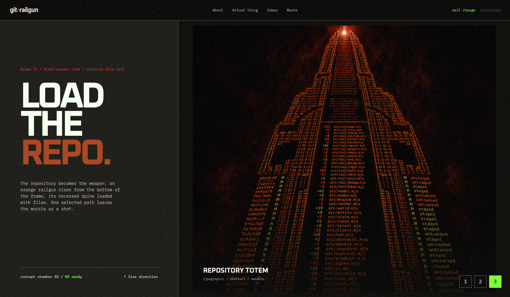
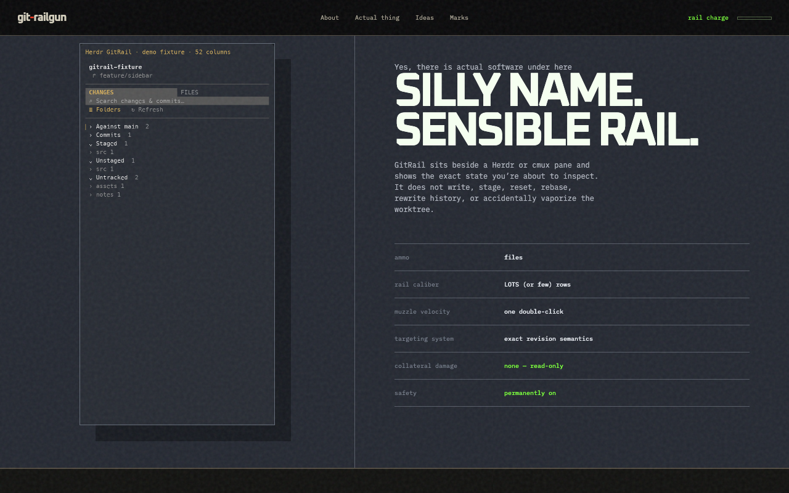
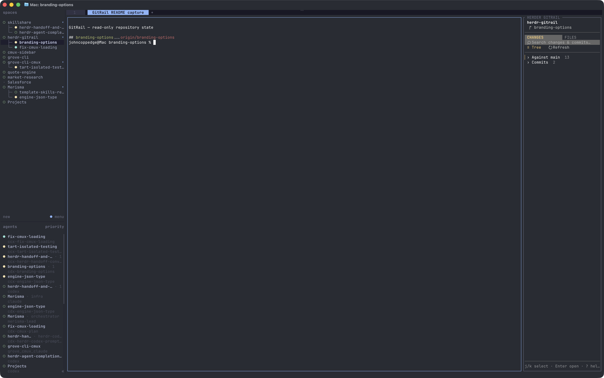
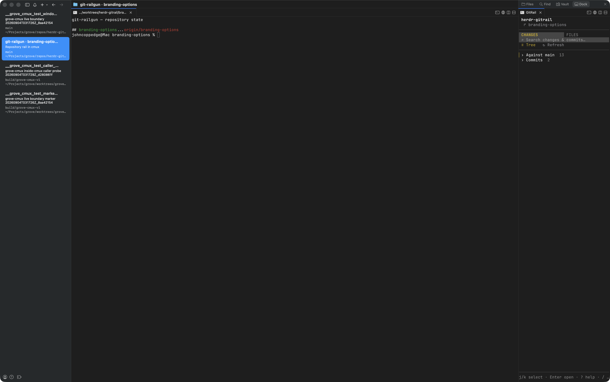

<p align="center">
  
</p>

<h1 align="center">git-railgun</h1>

<p align="center"><strong>See every Git state. Open the exact revision. Change nothing.</strong></p>

<p align="center">A compact, read-only repository sidebar for Herdr and cmux.</p>

<p align="center">
  <a href="#install-and-launch">Quick start</a> &nbsp;|&nbsp;
  <a href="#interaction">Controls</a> &nbsp;|&nbsp;
  <a href="#exact-git-semantics">Git semantics</a> &nbsp;|&nbsp;
  <a href="#configuration">Configuration</a> &nbsp;|&nbsp;
  <a href="#documentation">Documentation</a>
</p>

<p align="center"><sub>git-railgun because gitrail was taken, and railguns &gt; just rails.</sub></p>

## Read the repo without touching it

<p align="center">
  
</p>

GitRail sits beside the current directory and keeps the source of every row
explicit. Against-base, Commit, Staged, Unstaged, Untracked, and clean-file
previews cannot be confused because each selection carries its exact Git scope
all the way into Diff or Raw view.

| Changes | Files | Preview |
| --- | --- | --- |
| Shows branch-relative, committed, staged, unstaged, and untracked state. | Shows every current tracked and untracked path, including clean files. | Opens the exact diff or raw revision represented by the selected row. |

The rail is read-only: it does not stage, reset, rebase, rewrite history, or
mutate repository contents. Outside a Git worktree, Files becomes a bounded
filesystem browser while Changes clearly reports that Git state is unavailable.

The Herdr host opens a plugin-owned sidebar. The separate cmux host uses the
same provider, models, TUI, and revision semantics in cmux's **right sidebar
Dock**, opening selections in the native file viewer. It does not use cmux's
left/custom-sidebar interpreter or ExtensionKit. See the
[cmux Dock guide](docs/CMUX.md).

## One rail. Two native homes.

### Herdr

<p align="center">
  <a href="docs/screenshots/herdr-host.png">
    
  </a>
</p>

GitRail follows the active pane inside a Herdr tab and keeps the repository
state in a plugin-owned sidebar.

### cmux

<p align="center">
  <a href="docs/screenshots/cmux-host.png">
    
  </a>
</p>

The cmux host resolves the window that owns its Dock surface, follows that
window's selected workspace, and opens files through cmux's native viewer.

## Install and launch

Requires Node.js 22+, Git 2.35+, and macOS or Linux. The Herdr host targets
Herdr 0.8.x. The cmux host is macOS-only and requires the right-sidebar Dock
controls described in the [cmux guide](docs/CMUX.md).

The launcher rejects Node versions older than 22. Release validation covers
Node 22 and 24 with Herdr 0.8.x. No editor is required: GitRail uses an
explicit editor when configured, otherwise `$EDITOR`; installed Herdr defaults
open Markdown files in the system application.

```bash
npm ci --ignore-scripts
npm run check
herdr plugin link .
herdr plugin action invoke local.git-rail.open-git-rail
```

For the cmux Dock, this checkout includes `.cmux/dock.json`. After running the
same install and check commands above, review the Dock control and accept
cmux's project trust prompt. A direct, fail-closed development launch is
also available from a cmux terminal in the intended project:

```bash
npm run cmux:launch
```

GitRail also declares `local.git-rail.toggle-git-rail`, which opens or closes
the verified plugin-owned sidebar in the current tab. Key bindings belong to
Herdr rather than GitRail configuration. For example:

```toml
[[keys.command]]
key = "ctrl+g"
type = "plugin_action"
command = "local.git-rail.toggle-git-rail"
description = "toggle GitRail sidebar"
```

Open the deterministic demo, which assembles a temporary real Git repository
and runs the production provider against it:

```bash
herdr plugin action invoke local.git-rail.open-git-rail-mockup
```

The demo contains committed, Against-base, partially staged, unstaged,
untracked text, and untracked binary states. It has no hard-coded hashes,
counts, patches, or pseudo-paths. Temporary repositories and editor copies are
owner-only. Copies handed to detached external viewers remain available for 15
minutes and are then removed automatically; all other copies are removed when
the preview exits normally or receives a handled signal.

Live Herdr captures of that demo are available at
[36 columns](docs/screenshots/gitrail-36.png),
[52 columns](docs/screenshots/gitrail-52.png), and
[100 columns](docs/screenshots/gitrail-100.png).

## Interaction

- `Tab` switches Changes and Files.
- `/` searches the active view; Changes search includes commit metadata and the
  paths changed by each loaded commit. GitRail loads the latest 200 first-parent
  commits and still shows the complete range count. `Ctrl-U` clears; Enter
  finishes.
- `g` toggles Tree and Folders layouts.
- `j`/`k` or arrows focus commit and file rows. Enter expands a focused commit
  or opens a focused file. `J`/`K` and the mouse wheel scroll, while `h`/`l`
  chooses a section and Space toggles it.
- `r` refreshes without resetting selection, expansion, layout, search, or
  scroll position.
- `?` opens an in-place shortcut and file-state legend. `?`, Escape, or `q`
  closes the legend without closing GitRail.
- Keyboard selection uses a gold focus rail and highlighted row. A gold marker
  at the right edge shows the current position whenever content scrolls.
- Escape clears the current selection; press Escape again to close GitRail.
  `q` closes GitRail immediately.
- A click selects. A double-click opens a dedicated Herdr preview tab.
- Folder expanders are currently mouse controls; commit expansion and file
  opening remain fully keyboard-accessible.

<details>
<summary><strong>View behavior, previews, and edge cases</strong></summary>

Against-base and Commits begin collapsed; Staged, Unstaged, and Untracked begin
expanded. Untracked is a separate section immediately after Unstaged and uses
Git's `?` marker, so a staged addition (`⊞`) cannot be confused with a file Git
has not begun tracking.
Folders begin collapsed in both Tree and Folders layouts. Expanding a folder
reveals one level at a time; nested folders remain collapsed until explicitly
expanded, including newly discovered Git subtrees. Explicitly expanded folders
stay expanded when an ancestor is collapsed and reopened. Searching expands the
matching paths so nested results remain keyboard-accessible. Select a folder
with `j`/`k` and press `Enter` to expand or collapse it.
Files and Changes render every discovered path immediately, and commit history
renders every loaded commit.

Files contains every tracked and untracked path that currently exists in the
worktree; deleted paths remain available in Changes and history only. Files
changed since the merge base use the same status and statistics as Against-base;
unchanged files use the neutral grey `□` and have no diff statistics. Outside a
Git worktree, Files scans the current directory without following directory
symlinks or entering `.git`, applies file/depth/time safety bounds, and keeps
every file visually neutral with the distinct filesystem-only `⊠`. Changes
remains Git-only.

The preview tab uses the selected basename as its label, sanitized and capped at
32 terminal columns. It replaces the previous plugin-owned preview tab, then
starts in the selected descriptor's exact diff, or Raw for a clean file. Use
`1` and `2` to select Diff and Raw. Raw wraps by default; Diff preserves lines.
`w` toggles wrapping, arrows or `j`/`k` scroll by a visual row, Page Up/Page Down
scroll by a viewport, `Ctrl-U`/`Ctrl-D` scroll by half a viewport, and the mouse
wheel scrolls. A gold marker at the right edge shows the current position.
Configured filename and extension matches add actions with explicit key
bindings. Installed defaults provide `o Open` for every file. In Herdr,
`.md`, `.mdx`, and `.markdown` automatically use that system action without
creating a preview tab. If system open is unavailable or disabled, the generic
preview remains the fallback. `/` searches
the current in-preview Diff or Raw content and `n`/`N` moves through matches. `e` opens the configured
editor; historical,
Against-base, staged, and deleted selections use an owner-only temporary copy of
the exact Raw revision. Binary and oversized content produce bounded,
actionable errors. A `?` statistic means the aggregate untracked-inspection
budget was reached; opening that file still computes its bounded preview.

</details>

## Exact Git semantics

| Selected row | Preview command |
| --- | --- |
| Files tab, changed | `git diff <merge-base(base, HEAD)> -- <path>` |
| Files tab, unchanged | Raw by default; Diff reports no change |
| Against base | `git diff <base>...HEAD -- <path>` |
| Commit | first-parent diff (`<parent>..<commit>`); root commits use the empty tree |
| Staged | `git diff --cached -- <path>` |
| Unstaged | `git diff -- <path>` |
| Untracked | complete addition from `/dev/null` |
| Clean | Raw by default; Diff reports no change |

GitRail uses NUL-delimited porcelain-v2, name-status, numstat, raw-diff, and
ls-files formats. Renames and copies retain old/new path pairs, while symlinks,
submodules, and type changes retain revision-specific mode metadata. The Files
model keeps all applicable states rather than selecting one ambiguous status.

A refresh is intentionally eventually consistent. GitRail assembles a frame
from several bounded Git commands rather than claiming an atomic snapshot of
HEAD, the index, and the worktree. A repository changing during refresh can
briefly show adjacent states or counts; filesystem invalidation and the recovery
poll converge on the next refresh. A failed refresh keeps the last usable state,
and `r` always requests an immediate retry.

## Configuration

Configuration merges by key in this order, with later entries taking
precedence:

1. built-in defaults;
2. `~/.config/git-rail/config.json`;
3. `$EDITOR` when no editor is configured;
4. `GIT_RAIL_*` environment overrides.

Colors are not part of this file. GitRail resolves its palette from the ANSI
indexed colors your terminal theme defines, then adopts Herdr's `accent`, `red`,
`green`, and `selection_bg` tokens when you have set them. See
[Colors and glyphs](docs/THEMING.md).

Use [git-rail.config.example.json](git-rail.config.example.json) as a starting
point. Configuration version 1 is validated; malformed JSON and invalid values
are shown in the rail instead of being ignored. Repository contents are never
read as configuration and cannot choose editor or viewer executables.

<details>
<summary><strong>Complete configuration behavior and examples</strong></summary>

Comparison bases resolve in this order: explicit `GIT_RAIL_BASE`, user
`baseRef`, `branch.<checked-out-branch>.gitrail-base` from local or worktree Git
config, an automatically detected local default branch, and finally its remote
fallback. If none exists, a committed `HEAD` is the final fallback. Every
explicitly or branch-configured ref must resolve to a commit; an invalid value
is reported without silently trying the next source.

Set and remove a branch-specific base in repository-local Git metadata (replace
the example branch and base names with your own):

```bash
git config --local 'branch.feature/my-work.gitrail-base' release/1.x
git config --local --unset-all 'branch.feature/my-work.gitrail-base'
```

For a setting isolated to one linked worktree, enable Git's worktree config and
use the worktree scope:

```bash
git config --local extensions.worktreeConfig true
git config --worktree 'branch.feature/my-work.gitrail-base' release/1.x
git config --worktree --unset-all 'branch.feature/my-work.gitrail-base'
```

Both scopes live under `.git`, are never committed, and can only choose the
comparison commit; they cannot select an executable. Detached HEAD ignores
branch keys. An unborn repository has no comparison until it has a commit.

`version` identifies the configuration format, not the GitRail release. It lets
GitRail reject a future incompatible format instead of interpreting changed
fields as commands. Backward-compatible additions remain on version 1. Viewer
`order` is still accepted for legacy automatic bindings, while new configuration
should use explicit `key` values.

GitRail opens automatically, without taking focus, in every Git-backed Herdr
tab when Herdr starts or a workspace or tab is created. Disable that globally in
`~/.config/git-rail/config.json`:

```json
{
  "version": 1,
  "herdr": { "autoOpen": false }
}
```

Non-Git tabs and GitRail's own file-preview tabs are ignored. Manual **Open
GitRail** actions remain available when automatic opening is disabled.
Once open, each rail follows the focused content pane in its own tab. Changing
that pane's directory updates the repository name and branch on refresh or the
recovery poll, including transitions into and out of Git worktrees.

Filesystem events are a refresh optimization. GitRail watches the worktree, its
absolute per-worktree Git directory, and the shared Git directory when the
platform supports recursive watching. The jittered recovery poll remains the
authoritative fallback when a watcher cannot be installed. It defaults to 10
seconds, accepts 1–300 seconds, and varies each interval by ±10% to avoid refresh
storms. Set `refresh.pollIntervalMs` in user configuration or
`GIT_RAIL_POLL_INTERVAL_MS` for the process.

New rails open at the configured terminal-column width. The installed default
matches the 34-column development rail; narrower layouts cap the rail at half
the available split, and Herdr's minimum split ratio still applies on unusually
wide layouts. Manual resizing after launch remains under Herdr's control:

GitRail never reconstructs a tab to force this placement. Automatic and manual
opening create a rail only beside a full-height outer pane; nested layouts that
cannot accept that split are left unchanged with a visible skip diagnostic.

```json
{
  "version": 1,
  "herdr": { "autoOpen": true, "sidebarWidth": 34 }
}
```

Editor integration is optional. Configure a terminal editor such as Neovim:

```json
{
  "version": 1,
  "editor": { "client": "nvim", "args": [], "mode": "terminal" }
}
```

Or configure an external application such as VS Code:

```json
{
  "version": 1,
  "editor": { "client": "code", "args": ["--reuse-window"], "mode": "external" }
}
```

Without `editor`, `GIT_RAIL_CLIENT`, or `$EDITOR`, editing is disabled and the
preview omits the `e` action.

Viewer actions are conditional per selected filename. Rules match an exact
basename, a dot-prefixed filename suffix such as `.pdf`, or `*`. Exact names do
not act as implicit suffixes: `Makefile` will not match `NotMakefile`. Every matching rule is shown,
so `*` can provide a global action alongside a file-specific action. Each
pattern accepts one rule or an array of rules, so multiple global or
file-specific actions can coexist. Each rule can configure its action `label`,
executable `client`, `args`, launch `mode`, single-letter-or-digit `key`, and
optional `autoOpen`. `embedded` mode captures bounded output and displays it in
GitRail's viewport; `{width}` in an argument expands to the available content
width. File-specific
rules win if two matching actions claim the same key. Preview navigation keys
are reserved and rejected by validation. Version-1 rules without `key` retain
legacy automatic numeric assignment. If no enabled rule matches, the preview omits
viewer actions. The built-in Markdown defaults use the system application:

```json
{
  "version": 1,
  "viewers": {
    ".md": {
      "label": "Open",
      "client": "system",
      "args": [],
      "mode": "external",
      "key": "o",
      "autoOpen": true
    }
  }
}
```

For example, two global actions can share the wildcard pattern:

```json
{
  "version": 1,
  "viewers": {
    "*": [
      { "label": "Open", "client": "system", "mode": "external", "key": "o" },
      { "label": "Open in Code", "client": "code", "mode": "external", "key": "9" }
    ]
  }
}
```

Supported overrides include `GIT_RAIL_BASE`, `GIT_RAIL_CLIENT`,
`GIT_RAIL_CLIENT_ARGS` (a JSON string array), `GIT_RAIL_CLIENT_MODE`, and
`GIT_RAIL_POLL_INTERVAL_MS`. Set `GIT_RAIL_DEBUG_LOG` to an explicit file path
for sanitized operation names, timestamps, durations, and exit status; source,
diffs, environment values, and command arguments are never logged.
Release validation may set `GIT_RAIL_WATCH_MODE` to `watch-only` or `poll-only`
to prove the two invalidation paths independently. Ordinary runs leave it unset
and retain both filesystem invalidation and the recovery poll.

Explicit `terminal`, `external`, and viewer-only `embedded` modes override
executable heuristics. `system` uses macOS `open` or Linux `xdg-open`; `none`
disables editing. External apps, including VS Code and Cursor, open outside
Herdr. The built-in Markdown rule invokes macOS `open` or Linux `xdg-open`
directly from the rail, so it never creates the generic preview tab. Embedded
renderers such as Glow remain available through explicit viewer configuration.

Viewer and editor actions materialize the exact selected commit, Against-base,
or staged revision with a bounded byte-preserving copy. This allows OS-default
Open and external applications to handle images, PDFs, and other binary files;
the terminal Raw view remains deliberately text-only and UTF-8 validated.

</details>

## Development

```bash
npm test
npm run lint
npm run snapshot
npm run check
```

The test suite builds disposable repositories and independently verifies each
descriptor. `npm run check` runs lint, the complete suite, and the enforced
coverage floors locally. This repository does not use GitHub Actions.

## Documentation

- [Installation and upgrades](docs/INSTALLATION.md)
- [Colors and glyphs](docs/THEMING.md)
- [cmux Dock host](docs/CMUX.md)
- [Troubleshooting](docs/TROUBLESHOOTING.md)
- [Production readiness](PRODUCTION-READINESS.md)
- [Releasing](docs/RELEASING.md)
- [Screenshot verification](docs/screenshots/README.md)
- [Security policy](SECURITY.md)
- [Contributing](CONTRIBUTING.md)
